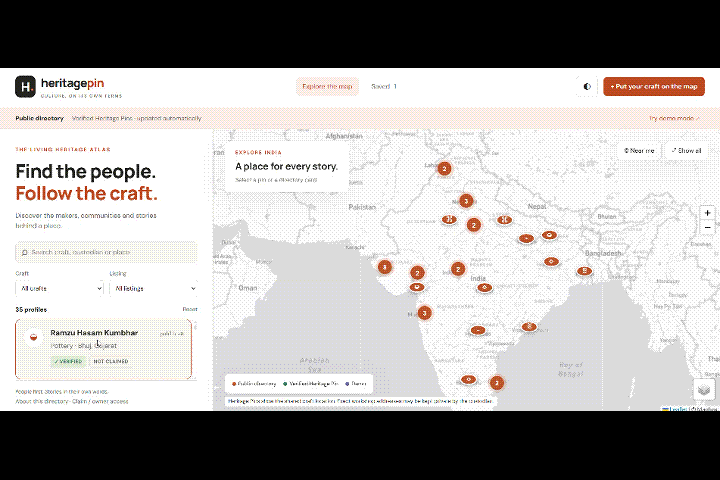

<p align="center">
  
</p>

<h1 align="center">BareMetal</h1>

<p align="center">
  <b>M# Hackathon 2026</b>
  &nbsp;·&nbsp;
  <b>UID 50084</b>
  &nbsp;·&nbsp;
  Problem Statement <b>P07</b>
</p>

<h3 align="center">HERITAGE PIN</h3>

<p align="center">
  <i>#Culture, on its own terms.</i>
</p>

<br>

<p align="center">
  A location-first digital atlas connecting people with India's artisans,
  cultural custodians, traditional crafts, and the stories behind them.
</p>

<br>

---
## 🌐 Live Demo

🔗 [heritagepin-baremetal.vercel.app](https://heritagepin-baremetal.vercel.app/)

## ▶️ Youtube video

🔗 [Watch Now](https://www.youtube.com/watch?v=Er5ppvFu4Pw)

---

---
## Telegram bot

[visit our telegram bot](https://t.me/HeritagePinDemoBot)

---

<p align="center">
  
</p>

<p align="center">
  <i>Interactive preview of the Heritage Pin web application.</i>
</p>

---

## 🌍 About

**Heritage Pin** is a location-first digital atlas designed to make India's living cultural heritage discoverable through the people and places that keep it alive.

Instead of treating traditional crafts as generic products in a tourism catalogue, Heritage Pin anchors custodians to their geographic location and puts their identity, craft, story, and community at the center of discovery.

The platform combines a lightweight interactive web map with a **Telegram-based onboarding system**, allowing artisans to create a Heritage Pin without downloading or learning a complex application.

---

## 🎯 The Problem

Traditional crafts and cultural knowledge are often difficult to discover digitally.

Existing tourism and marketplace platforms tend to focus on:

- Products rather than people
- Tourist experiences rather than custodians
- Generic locations rather than cultural geography
- Complex digital storefronts rather than simple onboarding

This can separate an artisan's craft from the place, identity, and story that give it meaning.

Heritage Pin approaches the problem from a different direction:

> **Put the people and their places on the map first.**

---

## 💡 The Solution

Heritage Pin works as a **location-first cultural discovery platform**.

Instead of asking an artisan to build an online store, the system allows them to interact with a simple Telegram bot.

The onboarding process collects:

- Public name
- Traditional craft
- Geographic location
- Craft video
- Voice story

The backend processes the submission, validates the location, creates a unique Heritage Pin and stores the profile in the platform database.

Visitors can then discover these profiles through an interactive map.

---

# 🧭 How It Works

```text
                         ARTISAN
                            │
                            ▼
                   ┌─────────────────┐
                   │  Telegram Bot   │
                   │                 │
                   │ Name            │
                   │ Craft           │
                   │ GPS Location    │
                   │ Video           │
                   │ Voice Story     │
                   └────────┬────────┘
                            │
                            ▼
                   ┌─────────────────┐
                   │ Flask Backend   │
                   │                 │
                   │ Validation      │
                   │ Geofencing      │
                   │ Pin Generation  │
                   │ Authentication  │
                   └────────┬────────┘
                            │
                   ┌────────┴────────┐
                   ▼                 ▼
            Firebase Auth      Firebase RTDB
                   │                 │
                   └────────┬────────┘
                            │
                            ▼
                     HERITAGE PIN
                            │
                            ▼
                   ┌─────────────────┐
                   │ Web Application │
                   │                 │
                   │ HTML/CSS/JS     │
                   │ Leaflet.js      │
                   └────────┬────────┘
                            │
                            ▼
                    INTERACTIVE MAP
                            │
              ┌─────────────┼─────────────┐
              ▼             ▼             ▼
           Search        Explore       Profile
              │             │             │
              └─────────────┼─────────────┘
                            ▼
                    Direct Discovery
```

---

# 👤 Artisan Onboarding

The primary onboarding route is through **Telegram**.

No dedicated application download is required.

The conversation follows five stages:

```text
1. Name
      ↓
2. Craft
      ↓
3. Location
      ↓
4. Craft Video
      ↓
5. Voice Story
```

### 1. Name

The artisan provides their public name or collective name.

### 2. Craft

The artisan describes the traditional craft they practice.

### 3. Location

The artisan shares their location using Telegram's native location-sharing functionality.

The backend receives:

```text
Latitude
Longitude
```

The coordinates are then checked against the supported geographic boundary.

### 4. Craft Video

The artisan submits a short video demonstrating their craft.

The Telegram file ID is retained by the current implementation as part of the onboarding process.

### 5. Voice Story

The artisan sends a voice note describing their work, heritage, or craft in their own language.

---

# 🧠 AI Processing

Heritage Pin includes an AI-processing layer for voice stories.

The intended pipeline is:

```text
Voice Note
    ↓
Speech Recognition
    ↓
Language Detection
    ↓
Translation
    ↓
Structured Heritage Story
```

The current implementation exposes a demo processing function that produces:

- Original transcript
- English translation
- Detected language
- Confidence score

The architecture is designed so that a production speech/translation model can replace the current demonstration layer.

---

# 📍 Heritage Pins

Every verified submission receives a unique Heritage Pin ID.

Example:

```text
HP-A7K92Q
```

A Heritage Pin can contain:

```text
Name
Craft
Place
Latitude
Longitude
Story
Profile
Reviews
Verification Status
Claim Status
Contact Information
```

The map represents a shared craft location rather than necessarily exposing an exact private workshop address.

---

# 🗺️ Interactive Heritage Map

The public website is centered around an interactive map powered by **Leaflet.js**.

Visitors can:

- Explore Heritage Pins across India
- Select individual pins
- Open artisan profiles
- Search by name, craft, place or story
- Filter by craft
- Filter by listing type
- View saved profiles
- Locate themselves
- Fit the map to visible pins
- Switch map layers
- Switch between light and dark themes
- View clustered markers

### Map Technologies

```text
Leaflet.js
Leaflet MarkerCluster
Mapbox
MapTiler
```

Marker clustering prevents large numbers of geographically close Heritage Pins from visually overlapping.

---

# 🔎 Search & Discovery

The discovery interface allows visitors to search across:

```text
Artisan / Custodian
Craft
Place
Story
```

Additional filters include:

```text
All Crafts
Artisans
Custodians
Verified Submissions
```

The profile list and map markers update dynamically based on the selected filters.

---

# ⭐ Saved Profiles

Visitors can save Heritage Pins they want to revisit.

Saved profile IDs are stored locally using browser:

```text
localStorage
```

This means visitors do not need to create an account just to save profiles.

---

# 👤 Claiming a Heritage Pin

Artisans can claim ownership of their Heritage Pin through the website.

The flow is:

```text
Heritage ID
      +
Password
      ↓
Firebase Authentication
      ↓
Ownership Verification
      ↓
Claimed Heritage Pin
      ↓
My Profile
```

Once claimed, the custodian can manage their public profile.

---

# ✏️ Profile Management

Claimed custodians can update information such as:

- Public name
- Craft
- Story
- Biography
- Phone
- WhatsApp
- Website
- Profile photographs

The backend verifies the authenticated owner before allowing profile changes.

---

# 🔐 Authentication

Heritage Pin uses **Firebase Authentication** for profile ownership.

Each Heritage Pin receives an internally generated authentication identity.

The onboarding system generates:

```text
Heritage ID
+
Password
```

These credentials are provided to the artisan through Telegram.

Private authentication information is kept separate from the public Heritage Pin data.

---

# 🔥 Firebase Database

The current implementation uses:

**Firebase Realtime Database**

The primary database structure is:

```text
heritage_pins/
│
├── HP-A7K92Q
│   ├── id
│   ├── type
│   ├── name
│   ├── craft
│   ├── place
│   ├── lat
│   ├── lng
│   ├── status
│   ├── claimed
│   ├── story
│   ├── profile
│   └── reviews
│
└── HP-X2P81M
    └── ...
```

Internal authentication and ownership fields are removed before public profile information is returned to the frontend.

---

# 🤖 Telegram + Backend Architecture

The Python backend combines the REST API and Telegram onboarding system.

```text
                    Python Backend
                          │
             ┌────────────┴────────────┐
             │                         │
             ▼                         ▼
        Flask REST API           Telegram Bot
             │                         │
             ▼                         ▼
       Web Application             Artisans
             │
             ▼
       Firebase Services
```

This architecture allows the same backend to manage both:

- Artisan onboarding
- Public website requests

---

# 📡 API

The frontend communicates with the Flask backend through REST endpoints.

### `GET /`

Returns basic backend health and service information.

### `GET /api/config`

Returns frontend configuration such as:

- Telegram bot username
- Speech availability
- Supported languages

### `GET /api/pins`

Retrieves publicly available verified Heritage Pins.

### `POST /api/claim`

Authenticates a custodian and claims a Heritage Pin.

### `PUT /api/profile`

Updates a claimed Heritage Pin profile.

Authenticated requests use:

```http
Authorization: Bearer <token>
```

---

# 🛠️ Technology Stack

| Layer | Technology | Purpose |
|---|---|---|
| Frontend | HTML5 | Application structure |
| Styling | CSS3 | UI and responsive design |
| Frontend Logic | Vanilla JavaScript | Application logic and state |
| Mapping | Leaflet.js | Interactive geographic map |
| Marker Clustering | Leaflet.markercluster | Map marker management |
| Map Tiles | Mapbox / MapTiler | Geographic visualization |
| Backend | Python | Server-side logic |
| API | Flask | REST API |
| CORS | Flask-CORS | Frontend/backend communication |
| Onboarding | Telegram Bot API | Artisan onboarding |
| Authentication | Firebase Authentication | Profile ownership |
| Database | Firebase Realtime Database | Heritage Pin storage |
| Browser Storage | localStorage / sessionStorage | Saved and demo data |
| Backend Hosting | Render | API and Telegram bot |

---

# 🎨 Design System

Heritage Pin uses a minimal editorial-inspired visual language designed to keep the focus on people, stories and geography.

## Typography

```text
Headings → Manrope
Body/UI  → DM Sans
```

## Light Theme

```text
Background    #F7F6F2
Surface       #FFFFFF
Text          #252621
Muted         #6D7068
Border        #E5E5DF
Accent        #BD4A23
Orange        #ED7448
Soft Accent   #FBEDE6
```

## Dark Theme

```text
Background    #181B1A
Surface       #232725
Text          #F0F0E8
Muted         #B2B8B1
Border        #3D433E
Accent        #FFA17A
Soft Accent   #3C2B23
```

---

# 🖥️ Website Interface

The main application is divided into two primary areas:

```text
┌─────────────────────────┬───────────────────────────────┐
│                         │                               │
│     DISCOVERY PANEL     │          HERITAGE MAP         │
│                         │                               │
│  Search                 │                               │
│  Craft Filter           │       Interactive Map         │
│  Listing Filter         │                               │
│                         │     ● Heritage Pin             │
│  Profile Cards          │     ● Heritage Pin             │
│                         │     ● Heritage Pin             │
│                         │                               │
└─────────────────────────┴───────────────────────────────┘
```

This allows users to discover a person from the directory and immediately understand where their craft is geographically situated.

---

# 🧪 Demo Mode

The application includes a dedicated **Demo Mode** for hackathon presentations.

Demo mode can display:

- Sample Heritage Pins
- Demo profiles
- Demo map locations
- Browser-created profiles

Demo information is stored locally in the browser.

This allows the complete discovery interface to be demonstrated without requiring a live artisan onboarding session.

---

# 📁 Project Structure

```text
heritage-pin/
│
├── index.html
├── style.css
├── app.js
├── directory.json
├── main.py
├── baremetal-logo.png
├── website.gif
│
└── README.md
```

### `index.html`

Contains the main website structure and UI components.

### `style.css`

Contains:

- Design system
- Responsive layout
- Light/dark themes
- Cards
- Buttons
- Forms
- Dialogs
- Map interface

### `app.js`

Controls the frontend application logic:

- API communication
- Map initialization
- Marker rendering
- Search
- Filtering
- Saved profiles
- Demo mode
- Claiming
- Profile editing
- Geolocation
- Theme switching

### `directory.json`

Contains public directory records used by the frontend.

### `main.py`

Contains:

- Flask API
- Telegram bot
- Firebase integration
- Authentication
- Geofencing
- Heritage Pin generation
- Profile claiming
- Profile management

### `website.gif`

Animated preview of the Heritage Pin web application used in this README.

### `baremetal-logo.png`

Project/team logo displayed in the README header.

---

# 🔄 Complete User Journey

## For an Artisan

```text
Open Telegram
      ↓
Start Heritage Pin Bot
      ↓
Enter Name
      ↓
Enter Craft
      ↓
Share Location
      ↓
Send Craft Video
      ↓
Send Voice Story
      ↓
Backend Processing
      ↓
Location Validation
      ↓
Heritage ID Generation
      ↓
Firebase Authentication
      ↓
Heritage Pin Creation
      ↓
Receive Credentials
      ↓
Claim Profile
      ↓
Manage Profile
```

## For a Visitor

```text
Open Website
      ↓
Explore Heritage Map
      ↓
Search / Filter
      ↓
Select Heritage Pin
      ↓
Open Custodian Profile
      ↓
Read Story
      ↓
Explore Craft
      ↓
Save Profile
      ↓
Contact Custodian
```

---

# 🔒 Privacy & Location

Heritage Pin is designed to distinguish between a **public cultural location** and a **private workshop address**.

The map represents a shared craft location, while exact workshop addresses can remain private.

Internal information such as:

```text
Authentication Email
Telegram User ID
Firebase Owner UID
Credential Metadata
```

is not exposed through the public pin data.

---

# 🚀 Deployment

## Frontend

The frontend is a static HTML/CSS/JavaScript application.

It can be deployed using platforms such as:

```text
Vercel
Netlify
GitHub Pages
```

Configure the backend URL using:

```javascript
window.HERITAGE_API_BASE = "https://YOUR-RENDER-APP.onrender.com";
```

---

## Backend

The Python backend can be deployed on Render.

Required environment variables include:

```text
BOT_TOKEN
FIREBASE_API_KEY
FIREBASE_DB_URL
RENDER_PUBLIC_URL
BOT_USERNAME
PORT
```

---

# 📦 Backend Dependencies

The backend uses:

```text
Flask
Flask-CORS
requests
python-telegram-bot
```

along with Python standard-library modules.

---

# ⚠️ Current Implementation

The current repository represents the **working hackathon prototype**.

### Implemented

- Telegram onboarding
- Name collection
- Craft collection
- GPS collection
- Geographic validation
- Video evidence reception
- Voice story processing pipeline
- Heritage ID generation
- Firebase Authentication
- Firebase Realtime Database
- Verified Heritage Pins
- Leaflet map
- Marker clustering
- Search
- Filtering
- Saved profiles
- Profile claiming
- Profile editing
- Demo mode
- Geolocation
- Light/dark themes

### Future / Production Architecture

The broader architecture can be extended with:

- Production speech recognition
- NVIDIA NIM / Canary integration
- PostgreSQL + PostGIS
- Advanced spatial queries
- NGO-assisted verification
- Human-in-the-loop verification
- Proof-of-origin mechanisms
- Assisted field onboarding
- Regional-language processing
- Community verification

The current prototype keeps these components modular so they can be integrated without changing the core Heritage Pin discovery experience.

---

# 🌱 Future Scope

Heritage Pin can evolve into a broader digital infrastructure for living heritage.

Potential extensions include:

- PostGIS-powered spatial discovery
- Advanced AI transcription and translation
- Regional-language support
- Human / NGO verification workflows
- Proof-of-origin certificates
- Craft-cluster discovery
- Heritage trails
- Community-led verification
- Direct artisan-to-buyer communication
- Assisted onboarding through local partners
- Rich cultural storytelling

---

# 🎯 Why Heritage Pin?

Traditional digital platforms often follow:

```text
Product → Marketplace → Seller
```

Heritage Pin changes the starting point:

```text
Place → Person → Craft → Story
```

The result is a geographic cultural atlas where traditional knowledge is connected to the people and places that keep it alive.

---

# 🌍 Vision

> **Culture should be discovered through the people and places that keep it alive.**

Heritage Pin aims to make India's living heritage more visible without forcing custodians to become digital marketers, developers, or e-commerce operators.

The platform puts the:

```text
Custodian
    ↓
Place
    ↓
Craft
    ↓
Story
```

at the center of the experience.

Technology exists in the background to make that discovery possible.

---

<p align="center">
  <b>Heritage Pin</b>
  <br>
  <i>Culture, on its own terms.</i>
  <br><br>
  Built by <b>BareMetal</b>
</p>
